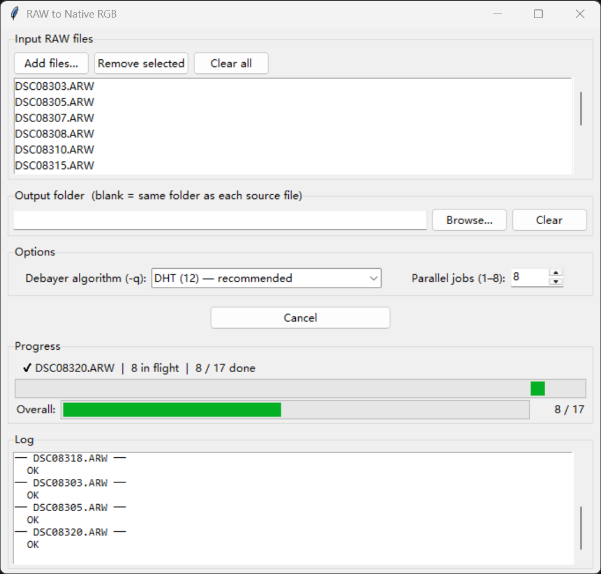
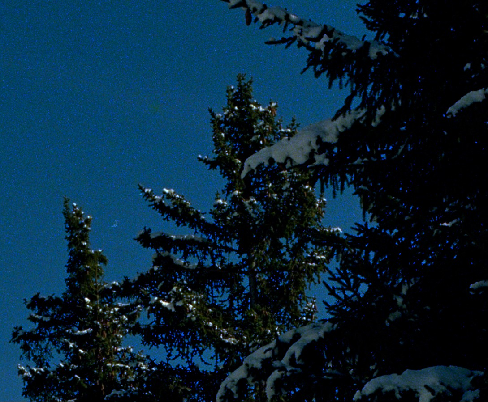
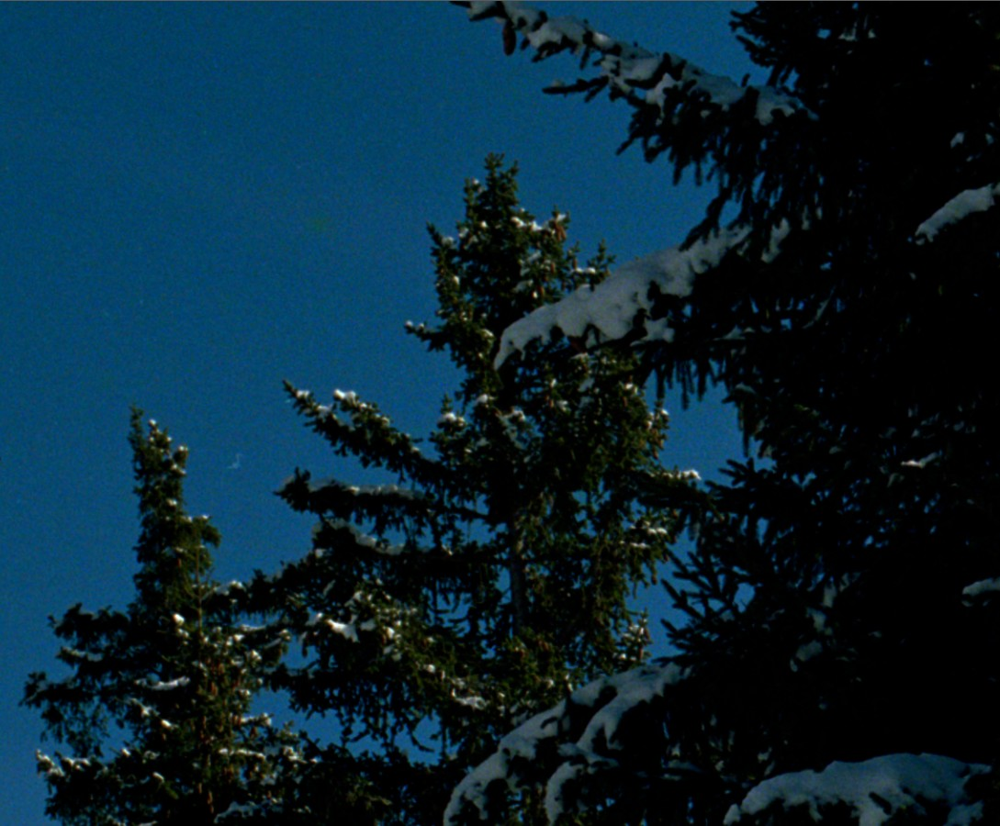
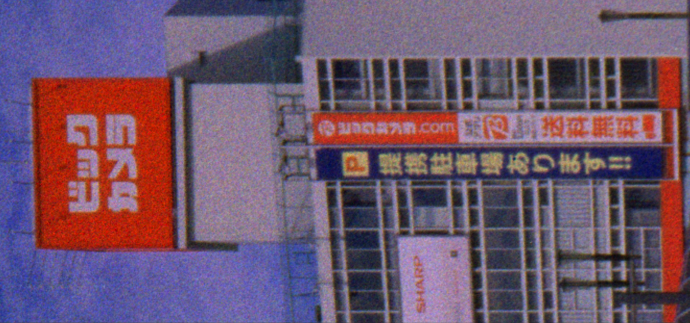

# RAW to Native RGB

Batch GUI for converting camera RAW files to **native RGB TIFF** using [LibRaw](https://www.libraw.org/) (`dcraw_emu`).

Output files are **linear, 16-bit, camera-native colour space** — no white balance scaling, no tone curve, no colour space conversion. Designed as a lossless first step before further processing in software that can accept native RGB data.

## Requirements

- Python 3.12+
- [uv](https://docs.astral.sh/uv/) (dependency/environment manager)
- `dcraw_emu` binary from LibRaw (see below)
- [`tkinterdnd2`](https://pypi.org/project/tkinterdnd2/) (installed automatically via `uv sync`)

## Getting dcraw_emu

**Windows** — download a pre-built Win64 package from the [LibRaw download page](https://www.libraw.org/download) and copy two files from `LibRaw-x.xx.x-Win64\LibRaw-x.xx.x\bin\` into `bin/windows/`:

```
bin/windows/dcraw_emu.exe   ← LibRaw-x.xx.x-Win64\LibRaw-x.xx.x\bin\dcraw_emu.exe
bin/windows/libraw.dll      ← LibRaw-x.xx.x-Win64\LibRaw-x.xx.x\bin\libraw.dll
```

Both files must be present — `dcraw_emu.exe` will fail with a DLL error if `libraw.dll` is missing.

**macOS** — download a pre-built macOS package from the [LibRaw download page](https://www.libraw.org/download) and copy the binary from `LibRaw-x.xx.x-macOS/LibRaw-x.xx.x/bin/` into `bin/macos/`:

```
bin/macos/dcraw_emu         ← LibRaw-x.xx.x-macOS/LibRaw-x.xx.x/bin/dcraw_emu
```

Alternatively, install via Homebrew:
```bash
brew install libraw
cp $(which dcraw_emu) bin/macos/dcraw_emu
```

## Running

```bash
uv run raw_to_rgb
```

On first launch the log area confirms whether the binary was found.

**Windows — non-ASCII paths:** source files or output folders with characters outside the system code page (e.g. Chinese or Japanese directory names) are handled automatically via 8.3 short paths or a temporary hard-link, so no manual renaming is required.

## Supported RAW formats

`.arw` `.cr2` `.cr3` `.nef` `.orf` `.rw2` `.dng` `.raf` `.raw`

## GUI overview



| Section | Description |
|---|---|
| **Input RAW files** | Add individual files or drag & drop from Explorer; supports multi-select and removal |
| **Output folder** | Leave blank to write TIFFs beside each source file |
| **Debayer algorithm** | Select demosaicing algorithm (see below) |
| **Parallel jobs** | Number of files to convert simultaneously (1–8) |
| **Progress** | Indeterminate activity bar + overall file counter showing `{success}✓ {errors}✗ / {total}` |
| **Log** | Per-file output from `dcraw_emu`; cleared on each run |

The Convert button toggles to **Cancel**, which signals all in-flight workers to skip remaining files.

Failed conversions are **automatically retried once** after the initial pass completes. Listbox rows turn yellow during retry, green on success, and red on final failure.

## dcraw_emu flags used

| Flag | Meaning |
|---|---|
| `-r 1 1 1 1` | Unity white-balance multipliers (no scaling) |
| `-M` | Apply embedded colour matrix |
| `-o 0` | No output colour space conversion (camera native) |
| `-W` | No auto-brightness |
| `-q <N>` | Debayer algorithm (user-selected) |
| `-4` | Linear 16-bit output |
| `-T` | Write TIFF |

## Debayer algorithms

| Value | Name | Notes |
|---|---|---|
| 12 | DHT | Default — high quality, slower |
| 3 | AHD | Adaptive Homogeneity-Directed |
| 13 | Modified AHD (AAHD) | |
| 11 | LMMSE | Good for high ISO / noisy files |
| 4 | DCB | |
| 2 | PPG | |
| 1 | VNG | Variable Number of Gradients |
| 0 | Bilinear | Fastest, lowest quality |
| — | No Debayer — Half Resolution Output | Skips demosaicing entirely; outputs each Bayer channel as-is at half resolution (`-q 0 -h`). See below. |

## No Debayer mode — scanning chromogenic negatives

When scanning chromogenic negative film on a Bayer-sensor camera, conventional demosaicing can introduce severe colour speckle. The dye clouds in the film grain are close in size to the Bayer mosaic pitch, which causes the demosaicing algorithm to produce extreme values that are meaningless in either colorimetry or densitometry — producing an unpleasant speckled pattern that is very difficult to remove in post.

| Before (standard debayer) | After (no debayer) |
|---|---|
|  |  |
|  |  |

**No Debayer — Half Resolution Output** bypasses demosaicing entirely. Each RAW Bayer channel is directly saved, producing a clean, grain-consistent result without colour speckle. The trade-off is a 2× reduction in linear resolution (half width × half height), which is usually acceptable when the goal is to capture grain structure faithfully rather than resolve fine edge detail. Plus, one can sharpen the image later without having to deal with the speckle problem.
